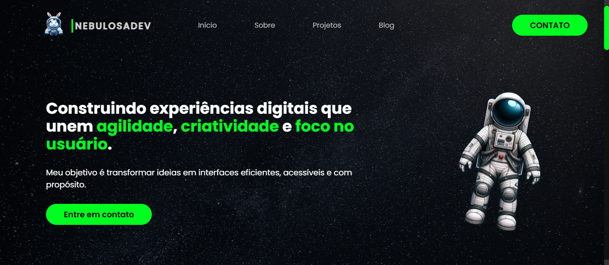

<h1 align="center">
  💻  Portifolio Pessoal - Gabriela Vieira
</h1>

<h4 align="center"><a href="https://www.iuricode.com/">VISITE O PROJETO</a></h4>

## 🗂️ Estrutura do Site

O portfólio é composto pelas seguintes páginas e seções:

1. **Página Inicial**
   - **Sobre Mim**: Uma breve introdução sobre quem eu sou, minha formação e experiência.
   - **Meus Interesses**: Informações sobre minhas áreas de interesse e paixões profissionais.
   - **Projetos**: Destaques dos projetos em que trabalhei, com links para detalhes adicionais.
   - **Habilidades**: Lista das habilidades e competências que possuo.
   - **Contato**: Informações sobre como entrar em contato comigo.

2. **Página de Projetos**
   - Uma página dedicada a listar todos os projetos que desenvolvi.

3. **Páginas de Projetos Individuais**
   - Cada projeto listado na Página de Projetos possui uma página dedicada com uma descrição detalhada, tecnologias utilizadas, imagens e, se aplicável, links para o projeto ao vivo ou repositório GitHub.
---
## 🚀 Tecnologias Utilizadas

- **HTML**: Estruturação do conteúdo.
- **CSS**: Estilização e design responsivo.
- **JavaScript**: Funcionalidades interativas e animações.
- **ScrollReveal.js**: Efeitos de animação ao rolar a página.
---
## 👩🏻‍💻 Contato

Para qualquer dúvida ou sugestão, você pode me encontrar em:

- [LinkedIn](https://www.linkedin.com/in/seu-perfil)
- [E-mail](mailto:seu-email@example.com)

